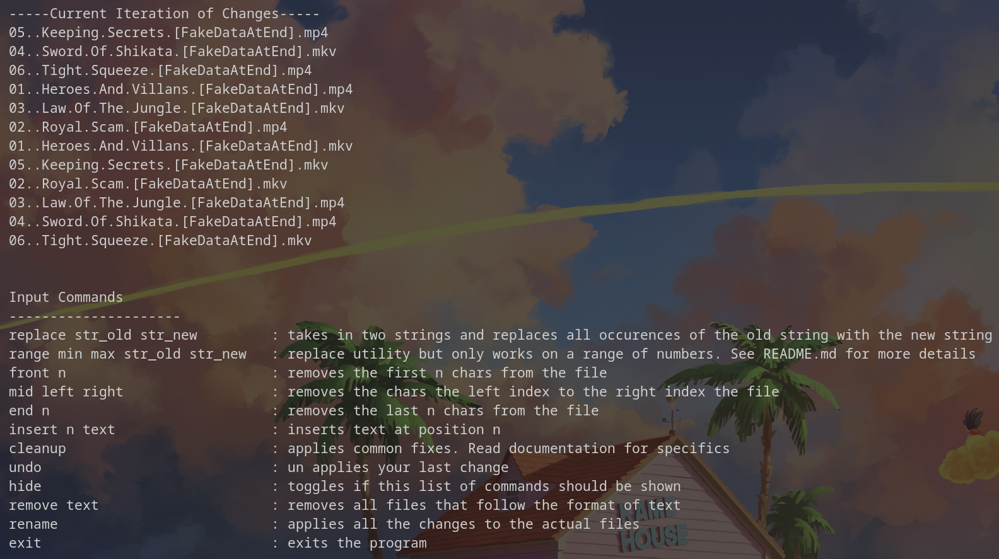

# Bulk Renamer Example

The files we are trying to rename in this example are
```sh
03..Law.Of.The.Jungle.[FakeDataAtEnd].mp4
03..Law.Of.The.Jungle.[FakeDataAtEnd].mkv
01..Heroes.And.Villans.[FakeDataAtEnd].mp4
06..Tight.Squeeze.[FakeDataAtEnd].mkv
04..Sword.Of.Shikata.[FakeDataAtEnd].mp4
06..Tight.Squeeze.[FakeDataAtEnd].mp4
01..Heroes.And.Villans.[FakeDataAtEnd].mkv
02..Royal.Scam.[FakeDataAtEnd].mp4
02..Royal.Scam.[FakeDataAtEnd].mkv
04..Sword.Of.Shikata.[FakeDataAtEnd].mkv
05..Keeping.Secrets.[FakeDataAtEnd].mkv
```



For the TV show, Spider-Man the New Animated Series
1. We are going to first input

```sh 
insert 0 "Spider-Man the New Animated Series S01E"
```
To add the title of the tv show and the season number to the front.

2. 
